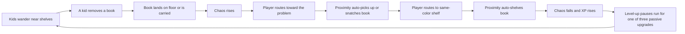
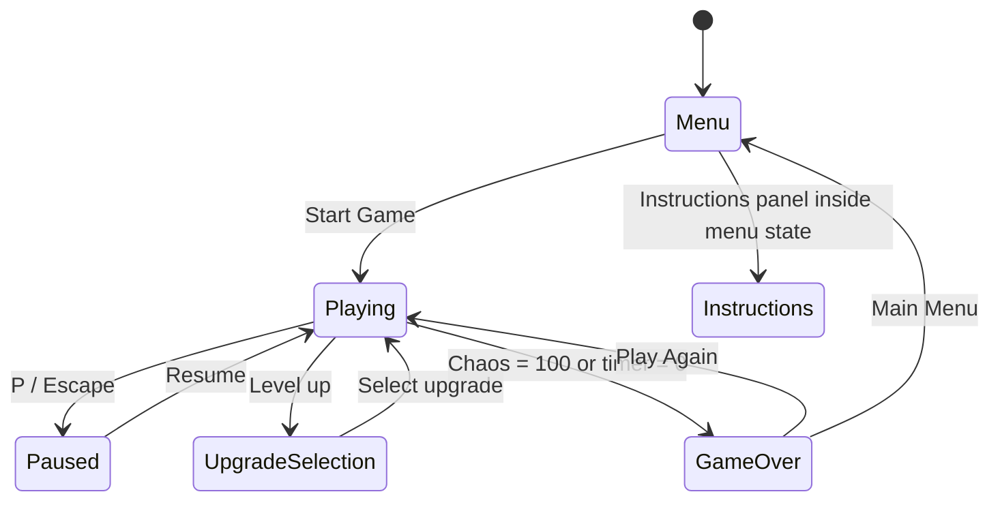
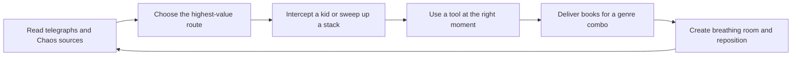
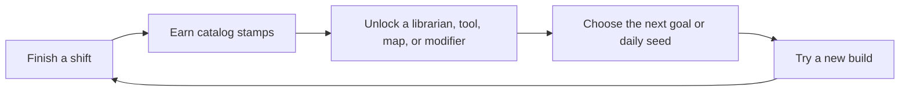

# The Librarian 2.0

## Product, game design, UX, art, and engineering roadmap

**Status:** 3D development branch implemented; external playtest and public-release gates pending
**Prepared:** July 20, 2026
**Source of truth analyzed:** `origin/main` at `0a3b9e809b89674e9897e6b4981a44499d0e25d6`

> **Visual-direction decision:** The later request for a full 3D reimagining supersedes the original 2D/Phaser recommendation preserved in the initial analysis. The implementation uses Babylon.js, TypeScript, and Vite with a fixed orthographic storybook-diorama camera. Historical references to pixel tiles or Phaser describe the decision path, not the current production direction.

---

## Executive decision

The current game has a genuinely good hook: restore order in a library while mischievous kids create escalating, slapstick chaos. Its strongest identity is not “a shooter in a library.” It is a **chaos-control action roguelite** built around routing, sorting, crowd control, and the physical satisfaction of putting a disordered room back together.

The 2.0 version should preserve that fantasy and rebuild almost everything around it:

- Keep automatic pickup and matching-shelf returns because they make movement fluid.
- Add active intervention tools, readable enemy behaviors, combo routing, timed objectives, and build-defining upgrade synergies so the player makes meaningful decisions every few seconds.
- Replace the 30-minute endurance target with a tightly authored **15-minute standard shift**, then add an 8-minute quick shift and endless mode only after the core run is fun.
- Replace the uniform shelf grid with hand-authored library spaces containing loops, shortcuts, activity zones, and recognizable landmarks.
- Rebuild the play layer in **Babylon.js + TypeScript + Vite**, in parallel with the existing game, rather than extending the 1,061-line `PlayingState` and the hand-built engine indefinitely.
- Establish one coherent **storybook 3D diorama** art direction. The current menu already communicates charm; the new in-game world needs to deliver that same promise with spatial clarity and tactile physicality.

The target feeling is:

> **Vampire Survivors pacing + Overcooked prioritization + a warm, slapstick library comedy.**

This document separates what exists today from what was only planned, diagnoses why the current loop runs out of depth, and defines a staged path to a real 2.0.

---

# Part I — What the game is today

## 1. The current product in one sentence

The Librarian, called “Library Survivors” internally, is a browser-based top-down action game in which the player moves around a library, automatically collects displaced color-coded books, automatically returns them to matching shelves, and uses proximity to scare book-stealing kids away while preventing a global Chaos meter from reaching 100% for 30 minutes.

The design document calls it “librarian-sim meets bullet heaven.” The implemented game is closer to a **movement-only logistics survival prototype**. The “librarian” portion exists; the “bullet heaven” build expression, combat rhythm, spectacle, and content escalation mostly do not.

## 2. How it is played

### Controls

| Input | Current behavior |
|---|---|
| WASD / arrow keys | Move in eight directions |
| Shift | Sprint at 1.5× speed while draining stamina |
| P / Escape | Pause |
| Mouse | Navigate menus and choose upgrades |

There is no pickup button, shelve button, aiming, active ability, attack, dodge, or context interaction. Touch events are recorded internally but do not drive movement or gameplay. Gamepad controls are not implemented.

### Start of a run

- The world is 1,600×1,040 pixels, viewed through a 1,280×720 canvas.
- The player begins at approximately `(50, 300)` with a 48×64 collision body.
- Thirty-two shelves are arranged as a uniform 4×8 grid.
- Each shelf begins with six matching books, for 192 books total.
- Shelf colors are distributed across six colors and shuffled each run.
- Two easy kids begin in the room.
- Additional kids spawn every 15 seconds, subject to a time-based population cap.
- The target timer begins at 30:00 and counts down.

### The actual moment-to-moment loop



The player’s real choices are therefore limited to:

1. Which displaced book or kid to pursue.
2. Which route to take through the shelf grid.
3. Whether to sprint.
4. Which of three passive stat increases to select on level-up.

Everything that resolves the problem is automatic once the player reaches the correct radius.

## 3. Current rules and balance

### Player baseline

| Stat | Current value |
|---|---:|
| Base movement speed | 96 px/sec, represented as 3 m/sec |
| Sprint multiplier | 1.5× |
| Stamina | 100 |
| Sprint drain | 20/sec |
| Stamina regeneration | 10/sec |
| Carry capacity | 5 books |
| Pickup radius | 1 m |
| Return radius | 0.5 m |
| Repel radius | 48 px |
| XP multiplier | 1.0× |
| Chaos dampening | 0% |

Sprint currently drains whenever Shift is held, even when shelf collision prevents the player from moving. This makes stamina feel disconnected from action and exposes the lack of collision-aware movement state.

### Book interactions

| Action | Base XP | Early-run XP | Chaos reduction |
|---|---:|---:|---:|
| Pick up a floor book | 5 | 7 | 0.50 |
| Return a book to its shelf | 10 | 15 | 1.00 |
| Snatch a carried book | 7 | 10 | 0.75 |

The “early-run XP” column reflects the live 1.5× multiplier during the first two minutes. A runtime test confirmed the complete pickup-and-return path: one nearby red book produced 7 XP on pickup and 15 XP when returned to its red shelf.

### Leveling

- Level 1 requires 100 XP.
- Each subsequent requirement is `floor(100 × 1.45^(level - 1))`.
- Level-up refills stamina and pauses the simulation for an upgrade draft.
- Three eligible passive upgrades are shown.

Implemented upgrade pool:

| Upgrade | Effect per rank | Max rank |
|---|---|---:|
| Comfy Shoes | +10% movement speed | 5 |
| Long Arms | +0.1 m pickup and return radius | 10 |
| Book Belt | +1 carry slot | 7 |
| Fitness | +10 stamina | 10 |
| Zen Focus | -2% chaos gain | 10 |
| Reading Glasses | +8% XP gain | 5 |

“Shush Wave” exists in data but is explicitly filtered out because the weapon system is still a TODO. This is the clearest single example of the gap between the advertised genre and the implemented build system.

### Kids

The game implements three numerical aggression tiers rather than distinct behavioral archetypes:

| Tier | Wander speed | Flee speed | Steal cooldown | Grab delay | Carry/drop time |
|---|---:|---:|---:|---:|---:|
| Easy | 70 | 100 | 4 sec | 1 sec | 8–10 sec |
| Normal | 80 | 110 | 2.5 sec | 0.5 sec | 5–8 sec |
| Aggressive | 90 | 120 | 1.5 sec | 0.2 sec | 3–5 sec |

Their state machine supports wandering, approaching shelves, stealing, carrying books, and fleeing from the librarian. A stolen book has roughly equal chances of being knocked onto the floor or carried elsewhere. Player proximity makes a kid flee and can cause it to drop a carried book.

Population progression:

| Run time | Approximate kid cap / behavior |
|---|---|
| 0–1 min | 3 kids |
| 1–3 min | 5 kids |
| 3–5 min | 7 kids |
| 5–10 min | 10 kids |
| 10+ min | Cap increases by roughly 2 per minute |
| 5+ min | New spawns use normal aggression |
| 10+ min | New spawns use aggressive settings |

This produces more actors and faster theft, but not fundamentally new problems for the player to read or solve.

### Chaos

Chaos is generated by every book that is either on the floor or held by a kid:

| Run time | Chaos per unmanaged book per second |
|---|---:|
| 0–3 min | 0.05 |
| 3–5 min | 0.03 |
| 5+ min | 0.01 |

If no books are contributing, chaos decays by 0.1/sec. Otherwise there is no passive recovery. Chaos is capped at 100; reaching 100 immediately ends the run.

The rate per book declines as the run progresses, while kid count and aggression rise. This is difficult to reason about, hard to tune, and counterintuitive to the promised escalation. The early game can actually be the harshest part of the run.

### Win and loss

- **Win:** survive until the 30-minute timer expires.
- **Loss:** Chaos reaches 100%.
- No health, lives, individual patron satisfaction, boss completion, or alternative failure state exists.

## 4. Current application flow

The state stack consists of:



The custom state manager updates and renders only the top state. Because pause and upgrade selection are pushed over play but the underlying `PlayingState` is not rendered, these overlays replace the frozen game with a flat background. The player loses spatial context at exactly the moments when they need to inspect the situation and make a decision.

## 5. Current implementation architecture

The game is deliberately lightweight:

- Vanilla JavaScript ES modules.
- A single HTML canvas.
- Vite for local development and production bundling.
- A hand-built fixed-timestep loop targeting 60 Hz.
- Custom renderer, camera, input manager, asset loader, state stack, entities, and collision logic.
- No runtime game-engine dependency.

The implementation is small enough to understand but has reached the point where hand-built infrastructure is slowing down feature development.

### Architecture layers found in the repository

1. **Application shell and bootstrap** — `index.html`, `src/main.js`, `Game.js`.
2. **Game state and flow** — menu, play, pause, upgrade, and game-over states.
3. **Engine systems** — loop, renderer, camera, input, and asset loading.
4. **Gameplay domain model** — player, kids, shelves, books, and base entity.
5. **Project support** — Vite, package configuration, and design documents.

The original audit also generated a 47-node, 82-relationship local analysis graph. That transient tool output is intentionally excluded from version control; the durable findings are preserved in this document.

### Concentration and maintainability

- `PlayingState.js` is approximately 1,061 lines and owns world construction, spawning, chaos, XP, collisions, pickups, shelving, kid interactions, particles, camera, HUD, and run state.
- `Kid.js` is approximately 711 lines and combines AI state, movement, collision avoidance, book behavior, animation, and rendering.
- `Player.js` is approximately 459 lines and mixes input, locomotion, stats, collision state, rendering, particles, and upgrades.

This is not yet an unmaintainable codebase, but 2.0’s proposed content would turn those files into bottlenecks. The problem is not JavaScript itself; it is responsibility density and the lack of data-driven systems.

## 6. What is genuinely good already

### The theme is immediately legible

“Librarian versus library chaos” is specific, friendly, and easy to explain. It has a strong visual vocabulary—books, carts, stamps, reading rooms, shushing, return chutes, story time—and naturally supports humorous escalation without generic fantasy combat.

### The central restorative action is satisfying in concept

Most survival games ask the player to destroy increasingly large crowds. This game asks the player to restore order. That inversion is distinctive. Collecting several books, planning an efficient route, and snapping them into the correct shelves can become a very satisfying flow if feedback and combo systems are added.

### Automatic pickup and shelving support momentum

The player does not need to mash a button for every book. That is correct for a game with many objects. The automatic actions should remain, while the strategic decisions around them become richer.

### The menu communicates personality

The animated library background, large title treatment, music, and focused menu are more polished than the live playfield. They demonstrate that the project can feel atmospheric and charming when the presentation is coherent.

### The code has clean conceptual boundaries to migrate

Even though some files are too large, the game already has named concepts for states, entities, input, assets, camera, and progression. Those concepts map cleanly into a modern engine architecture.

## 7. What currently prevents the game from being fun for long

### P0 — The stated run and the real balance do not match

An untouched runtime test reached 100 Chaos at approximately **105 seconds**, ending the run before two minutes. The goal screen promises 30 minutes. This is not a difficulty curve; it is a broken contract.

The issue is systemic:

- The player starts with little room to learn.
- Kids begin producing unmanaged books immediately.
- Chaos has no understandable source breakdown.
- Recovery is too weak relative to early accumulation.
- Failure is immediate at 100 with no last-chance state.

### P0 — The starting position can trap the player against shelf collision

In a runtime test, holding right for two seconds moved the player only about 9.6 pixels before the adjacent shelf stopped further motion. Sprint continued draining stamina while blocked. A first-time player can interpret this as broken controls.

### P0 — Player agency is too shallow

The game resolves pickup, return, and kid interaction through proximity. Once the route is chosen, the player has nothing to time, aim, combine, or master. The passive upgrades mostly make the same automation faster or wider. A complete run does not yet offer a build fantasy.

### P0 — The playfield lacks readable spatial design

The 4×8 shelf matrix is mathematically tidy but creates:

- Repetitive corridors.
- Weak landmarks.
- Frequent collision friction.
- Minimal route variety.
- No authored arenas for events.
- No contrast between safe and dangerous zones.

### P1 — Escalation changes quantity, not behavior

More kids with faster steal timers increase pressure but do not ask the player to learn a new response. Strong survival games layer new behaviors so that combinations create emergent problems.

### P1 — The game does not fulfill its “bullet heaven” promise

There are no functioning weapons, active tools, evolutions, bosses, minibosses, or spectacular screen-clearing moments. The design document lists many of these, but the implementation contains only six passive stat upgrades.

### P1 — Visual quality collapses between menu and gameplay

- The menu uses a rich animated scene; gameplay uses simple shelf rectangles and very small characters.
- Large, high-resolution character images are scaled to tiny canvas dimensions, which makes detail unreadable and wastes memory.
- Several assets exist in both `public` and `src/assets`, increasing ambiguity and repository size.
- Art style and pixel density are inconsistent.
- Color is the main matching cue, which hurts accessibility.
- Arial and emoji-based upgrade icons make the interface feel provisional.

### P1 — Important state transitions lose context

Pause and level-up screens cover the simulation with flat color instead of showing the frozen library underneath. The result is visually abrupt and makes upgrade decisions less informed.

### P1 — The current architecture will resist content growth

New objectives, enemies, maps, tools, synergies, and events would all tend to land in `PlayingState.js`. There is no seeded run director, content schema validation, object pooling, save migration, audio mixer, or automated balance harness.

### P2 — Platform and quality gaps

- No automated tests or CI workflow.
- No save or meta-progression persistence.
- No input remapping, gamepad, or functional touch controls.
- No volume mixer or mute controls; audio is instantiated in multiple classes.
- Cache-busting asset URLs use `Date.now()`, preventing normal browser caching.
- The tracked asset set is roughly 40 MB and `public` alone is roughly 17 MB.
- `npm audit` currently reports four dependency advisories: one moderate and three high, concentrated in the old Vite dependency chain.
- Visibility changes can set an internal pause flag without transitioning to a visible pause state, creating a potentially silent frozen return.
- Camera shake contains a non-decaying magnitude expression and is not integrated into a coherent feedback system.

## 8. Design-document promise versus implementation

| Promised or planned | Current status | 2.0 decision |
|---|---|---|
| 30-minute survival | Timer exists; current balance fails near 2 minutes idle | Standardize on a denser 15-minute run |
| Automatic pickup and shelving | Implemented | Preserve and improve feedback |
| Repel/corral kids | Basic proximity flee implemented | Expand into readable crowd-control play |
| XP upgrade drafts | Six passives implemented | Build a tool/passive/synergy system |
| Shush Wave and skills | Data placeholder only | Make Shush Wave the signature starting tool |
| Distinct kid types | Numerical aggression tiers only | Add behaviorally distinct archetypes |
| Events and minibosses | Not implemented | Add authored crisis events at run beats |
| HP and damage | Not implemented | Do not add conventional violence/HP by default |
| Bosses | Not implemented | Use multi-stage “library crisis” finales |
| Meta progression | Not implemented | Add unlock catalog after the run loop proves fun |
| Endless mode | Not implemented | Post-2.0 or late beta feature |
| Multiple maps/heroes | Not implemented | Build only after vertical-slice validation |

The original plan contains many good ingredients, but implementing it literally would produce a generic survival-game checklist. 2.0 should use those ingredients only when they strengthen the restoration-and-crowd-control fantasy.

---

# Part II — The 2.0 product vision

## 9. Positioning

### Recommended title structure

Keep **The Librarian** as the recognizable master title. Use **The Librarian: After Hours** as a working subtitle while developing 2.0. It communicates the shift structure and the escalating-night premise without locking the product into the “Survivors” naming convention.

### New high concept

> The library is closing, but the building has other plans. Sprint between sections, recover runaway books, calm escalating disruptions, and assemble absurd librarian-tool synergies before the final bell.

### Audience

- Players who like approachable roguelites and short replayable runs.
- Players who enjoy task prioritization and cleanup loops.
- Cozy-game players who want more pace and mastery without grim combat.
- Streamers and viewers who respond to readable slapstick escalation.

### Platforms

1. Desktop web, keyboard and gamepad, first.
2. Installable web/PWA after performance and save behavior are stable.
3. Touch/mobile only after the HUD and control model prove they can remain readable.

Desktop-first is a scope decision, not a rejection of mobile. Designing every interaction for three control schemes before the core loop is proven would dilute the first vertical slice.

## 10. Product pillars

### Pillar 1 — Restoring order must feel fantastic

Every recovered book should create motion, sound, score, and visible improvement. A successful route should clean a whole aisle, fill a shelf, trigger a stamp/combo, and visibly calm the room.

### Pillar 2 — Chaos must be readable before it becomes overwhelming

The player should understand where pressure is coming from, which problem is about to get worse, and what action will resolve it. Failure should feel earned, not mysterious.

### Pillar 3 — Every run should create a distinct librarian build

Tools need behavior changes, not only percentage improvements. The player should be able to describe the run afterward: “I built the giant Bookmobile route,” “Storytime kept the whole children’s wing calm,” or “my Return Chute chain sorted half the map.”

### Pillar 4 — Escalation should be funny, authored, and surprising

A field trip arriving, a book fort appearing, paper airplanes crossing the reading room, or a runaway cart opening a new route is more memorable than simply spawning twelve faster versions of the same kid.

### Pillar 5 — Warmth without passivity

The game can be nonviolent and still demand skill. The player redirects, distracts, calms, organizes, and outmaneuvers. “Cozy” should describe the emotional tone, not the absence of pressure.

## 11. Explicit non-goals for 2.0

- No multiplayer at launch.
- No online account requirement.
- No battle pass, energy timer, loot box, or manipulative daily streak.
- No enormous procedural library before one authored map is excellent.
- No 20-tool content dump before four tools are genuinely fun.
- No conventional damage numbers or attacking children.
- No 30-minute standard run until the content can support it.
- No simultaneous rewrite of engine, art, all content, mobile, and backend in the first milestone.

---

# Part III — The redesigned game

## 12. The three nested loops

### Moment loop: 5–20 seconds



The target is one meaningful routing or intervention decision every 10–20 seconds, with constant tactile feedback between decisions.

### Run loop: 15 minutes


### Meta loop: multiple runs



Meta progression should unlock **new possibilities** more often than raw power. Mastery and build knowledge should remain the main reasons players improve.

## 13. Core controls and player agency

Recommended baseline:

| Action | Keyboard | Gamepad | Design purpose |
|---|---|---|---|
| Move | WASD / arrows | Left stick | Route through the library |
| Sprint / cart dash | Shift | Right trigger | Commit stamina for repositioning |
| Intervene | Space | South face button | Context-sensitive grab, quick-shelve, or calm action |
| Signature tool | Q | Left bumper | Player-timed crowd control |
| Pause | Escape / P | Menu | Accessible control and settings |

Most collected tools can auto-trigger like a survival game, but every character should have one player-timed signature action. This creates mastery without turning the game into a twin-stick shooter.

Automatic pickup and shelf return remain. The active verbs become:

1. **Route** — choose the order in which problems are solved.
2. **Intervene** — time a close-range action for bonus effect.
3. **Deploy** — use the signature tool to alter a crowd or route.
4. **Build** — draft tools and passives that transform those verbs.

## 14. Books, sorting, and combo play

### Accessible book identity

Every book genre uses three simultaneous identifiers:

- Color.
- A large icon or spine symbol.
- A short label in menus and accessibility modes.

Examples: red + flame = Adventure, blue + star = Science, green + leaf = Nature. Matching must never depend on color alone.

### Carry rack

Replace the plain book count with a visible ordered rack showing the actual carried genres. This creates routing decisions:

- Keep a mixed stack and visit several nearby shelves.
- Chase a single-genre stack for a combo.
- Drop or hand off a low-value book to make room for a rare book.
- Take a dangerous shortcut to preserve a streak.

### Sorting streaks

Reward clean, efficient routes rather than raw collection volume.

- **Neat Stack:** return three matching books in one delivery.
- **Perfect Sort:** empty the carry rack without a wrong-section interruption.
- **Aisle Clear:** resolve every loose book in a marked section.
- **Dewey Chain:** return books to three different sections inside a short window.

Streaks grant XP, small Chaos relief, satisfying audiovisual escalation, and temporary buffs. They should not become a fragile combo meter that punishes normal play; the point is to make mastery visible.

## 15. Chaos 2.0

Keep one master meter for immediate readability, but expose its sources:

1. **Clutter** — loose, thrown, or unsorted books.
2. **Noise** — loud kid behaviors and active disruptions.
3. **Disorder** — broken stations, blocked aisles, book forts, or failed objectives.

The HUD shows the dominant source beneath the master bar: “Mostly Noise — Storytime can calm this.” World markers point to the highest-risk hotspots.

### Thresholds

| Chaos | State | Effect |
|---:|---|---|
| 0–24 | Orderly | Normal music and behaviors |
| 25–49 | Busy | Slightly faster incidents; visible source pips |
| 50–74 | Disrupted | New combined behaviors and music layer |
| 75–99 | Critical | Strong warning, emergency objectives, clearer recovery rewards |
| 100 | Last Call | 8–10 second recoverable emergency before defeat |

This removes surprise failure. Reaching 100 is still dangerous, but a skilled player gets one final dramatic recovery opportunity.

### Tuning model

Do not make each book’s value inexplicably decline with elapsed time. Use a legible model:

`Chaos gain = capped active-source contribution × current event multiplier × difficulty modifier`

Then tune escalation through authored waves, source caps, and new behavior combinations. The player should be able to infer why the meter is moving.

## 16. Kid archetypes

Each archetype needs a silhouette, sound cue, telegraph, unique problem, and counterplay.

| Archetype | Behavior | Readable telegraph | Counterplay |
|---|---|---|---|
| Browser | Slowly removes nearby books | Looks back and reaches toward shelf | Gentle proximity aura or quick Intervene |
| Sprinter | Grabs one book and bolts through an aisle | Crouch and shoe squeak | Cut off route or use Shush Wave |
| Twins | Coordinate two simultaneous distractions | Matching callout icons | Separate them or use area control |
| Hider | Carries books behind shelves and becomes hard to track | Footprints and giggle | Follow trail or activate Reading Glasses |
| Snacker | Leaves sticky zones that slow the librarian | Crinkling bag and floor warning | Route around or clean with cart pass |
| Paper Plane Kid | Sends noise projectiles across long lanes | Folding animation and lane telegraph | Cross the lane after launch or redirect |
| Fort Builder | Converts loose books into an obstruction | Blueprint outline on floor | Deliver correct genres to dismantle efficiently |
| Tornado Toddler | Short, chaotic burst that scatters a local stack | Spinning windup | Time a calm tool during windup |
| Field Trip | A coordinated wave entering from one door | Bus bell and door countdown | Pre-position and prepare section objective |

The design goal is not “enemy variety” as a checklist. It is combinatorial pressure: a Sprinter becomes harder when a Fort Builder closes the shortest route; Twins become dangerous during a Noise objective.

## 17. Tools, passives, and evolutions

### Active and automatic tools

| Tool | Core behavior | Build fantasy |
|---|---|---|
| Shush Wave | Player-timed cone that interrupts theft and redirects kids | Crowd-control librarian |
| Rolling Cart | Periodic or triggered lane charge that vacuums books | High-speed route cleaner |
| Bookmark Boomerang | Travels out and back, collecting books and distracting kids | Precision collector |
| Storytime Aura | Creates a temporary zone that attracts and calms kids | Area-control support |
| Return Chute | Places a short-lived intake that sends books toward correct sections | Automation engineer |
| Dewey Drone | Carries one matching book at a time to its shelf | Passive logistics build |
| Stamp Storm | Marks nearby books; marked returns chain XP and calm | Combo/critical build |
| Dusting Bell | Sends periodic rings that reveal hidden problems and slow incidents | Information/control build |

### Passive categories

- Movement: shoes, sprint economy, turn responsiveness.
- Capacity: rack slots, grouped-stack bonus, rare-book slot.
- Reach: pickup magnet, return snap, tool radius.
- Control: shush force, calm duration, event resistance.
- Efficiency: XP, cooldown, objective rewards.
- Recovery: Chaos relief, emergency grace, stamina refill.

### Evolutions

An evolution requires a maxed tool plus a compatible passive or play achievement. Examples:

- **Shush Wave + Vocal Training → Silent Reading:** expanding wave leaves a calm zone.
- **Rolling Cart + Comfy Shoes → Bookmobile:** cart chains around corners and deposits matching stacks.
- **Bookmark + Long Arms → Express Return:** boomerang auto-targets the next matching shelf on return.
- **Storytime + Reading Glasses → Captivating Chapter:** affected kids help point out hidden books.
- **Return Chute + Book Belt → Interlibrary Loan:** chutes link two distant sections.

The first vertical slice needs only four tools, six passives, and two evolutions. Depth should be proven before breadth.

## 18. Objectives and authored events

Objectives give the player a temporary reason to prioritize one area over another.

### Section objectives

- Return a quota of Adventure books before story time.
- Recover a rare signed book being passed between kids.
- Keep the Reading Room below a Noise threshold for 45 seconds.
- Repair a checkout station by delivering three marked parts/books.
- Escort a rolling return cart through two sections.
- Clear a highlighted aisle before the next wave enters.

### Events

- **Story Time:** kids converge on one zone; correct positioning creates calm.
- **Book Drop:** a return bin opens and releases a timed sorting opportunity.
- **Power Flicker:** some shelf signs go dark; icons and map knowledge matter.
- **Fire Drill:** doors change and the route network temporarily shifts.
- **Rainy-Day Rush:** a larger group arrives with wet-floor hazards near entrances.
- **Inventory Check:** rare books become highly valuable but must be returned in order.

### Crisis finales instead of conventional bosses

A 15-minute run ends in a multi-stage logistics crisis, not a giant health bar.

Example: **The Field Trip Finale**

1. A bus countdown identifies two entry doors.
2. Waves split toward Children’s, Science, and Reading sections.
3. The player completes two section objectives while containing noise.
4. A mobile book fort blocks the central route.
5. Final phase: return three “Golden Books” while Chaos is locked above 60.

The finale tests routing, build power, crowd control, and map knowledge simultaneously.

## 19. Map design

Replace the repeated grid with an authored network:

- A central circulation desk that acts as a landmark.
- Wide outer loops for sprint routes.
- Narrow stacks that reward shortcuts and area tools.
- A Children’s Wing suited to crowd behaviors.
- A quiet Reading Room with noise-specific rules.
- A Return Room with conveyor/chute interactions.
- Locked staff doors or rolling ladders that become shortcuts during the run.
- Clear entrance doors for telegraphed waves.

The map should fit mentally after two or three runs. Randomize event locations, shelf genres, blockages, and objectives—not the entire topology—so mastery can develop.

### Recommended 2.0 content scope

| Content | Vertical slice | 2.0 release |
|---|---:|---:|
| Maps | 1 partial map | 2 complete maps |
| Librarians | 1 | 3 |
| Kid archetypes | 4 | 8 + Field Trip wave |
| Tools | 4 | 10–12 |
| Passives | 6 | 12–16 |
| Evolutions | 2 | 6–8 |
| Section objectives | 3 | 8–10 |
| Events | 1 | 5–6 |
| Final crises | 1 gray-box | 2 polished finales |

## 20. Run pacing

### Standard 15-minute shift

| Time | Purpose |
|---:|---|
| 0:00–1:00 | Contextual tutorial or fast opening; first books immediately available |
| 1:00–3:30 | Establish route and first tool identity |
| 3:30–4:30 | First authored event |
| 4:30–7:30 | Introduce second archetype combination and first evolution setup |
| 7:30–8:30 | Mid-shift crisis / map state change |
| 8:30–12:00 | Build mastery, harder objectives, meaningful recovery opportunities |
| 12:00–13:30 | Final preparation and high-value objective |
| 13:30–15:00 | Multi-stage finale |

### Other modes

- **Quick Shift:** 8 minutes, unlocked after onboarding; good for web/mobile sessions.
- **Standard Shift:** the balanced core experience.
- **Endless Night:** post-beta stretch goal; tests build ceilings and leaderboard play.
- **Daily Schedule:** deterministic seed and modifier; no streak punishment.

---

# Part IV — UX, UI, graphics, and audio

## 21. Experience flow

### New-player flow

1. Title screen with one primary action: **Start First Shift**.
2. Character walks into the library; movement prompt appears in world.
3. A book falls nearby; pickup and shelf identifiers are introduced through play.
4. A Browser approaches a shelf; the player learns Intervene/Shush.
5. First upgrade appears by 60–90 seconds.
6. A short objective demonstrates the Chaos source display.
7. First shift can end after an eight-minute onboarding finale.

The existing wall-of-text instructions remain accessible under Help, but they are not the primary teacher.

### Returning-player flow

`Title → Continue/Start Shift → librarian + map + modifier → run → shift report → one-click retry or loadout change`

The time from title to movement should be under ten seconds for a returning player.

## 22. HUD hierarchy

```text
┌ Objective: Quiet the Reading Room ───── CHAOS 42%: Mostly Noise ─── 09:18 / Wave 4 ┐
│                                                                                       │
│       world event marker                PLAYFIELD                    mini-map           │
│                                                                                       │
│                                                                                       │
│                                                                                       │
│ Carry Rack: [🔥][🔥][★][🌿][—]       [Q] SHUSH  4.2s       Sprint ███████░░░          │
└ Level 4  XP ██████░░  Perfect Sort ×3              Next event: Story Time in 0:28 ───┘
```

Recommended hierarchy:

- Top center: Chaos, current source, and threshold state.
- Top left: current objective and immediate progress.
- Top right: timer, event warning, and compact minimap.
- Bottom left: carried-book rack with color and icon.
- Bottom center: signature tool and major cooldown.
- Bottom right: stamina/sprint state.
- XP and combo feedback remain present but visually secondary to the current problem.

The current HUD gives Level, XP, Stamina, Books, Chaos, timer, and kid count similar visual weight. 2.0 should answer three questions first: **What is going wrong? Where is it? What can I do now?**

## 23. Pause, upgrades, and shift report

### Pause

- Freeze and dim the real playfield.
- Keep the map and active threats visible.
- Show Resume, Settings, Controls, Restart Shift, and Quit.
- Put destructive actions behind a confirmation.

### Upgrade draft

- Freeze the real playfield and retain spatial context.
- Use large illustrated tool cards with short, concrete verbs.
- Show current rank, next effect, compatible evolution, and how the choice affects the present build.
- Support keyboard/gamepad selection without requiring a mouse.
- Avoid emoji as production iconography.

### Shift report

Tell the story of the run:

- Result and difficulty.
- Chaos graph over time.
- Most-used tool and completed evolution.
- Books returned, sections cleared, kids calmed, objectives completed.
- Best combo and “save of the shift.”
- Unlock progress and a clear next goal.
- Retry with same seed, new shift, and return to catalog.

## 24. Art direction

### Production direction: storybook 3D diorama

- Locked three-quarter orthographic view, composed like a handcrafted miniature stage.
- Chunky, authored low-poly forms with painted materials rather than realism or generic asset-store geometry.
- Warm walnut, cream paper, brass, ink blue, and muted green as the shared palette; colder teal moonlight and metal distinguish the Archives.
- Bright genre colors reserved for interactable books, shelf signs, and event warnings, always paired with a symbol.
- Soft contact shadows, localized pools of light, controlled bloom, fog, and cutaway architecture create depth without obscuring routes.
- Characters use exaggerated 2.5-head proportions, readable props, and strong silhouettes at gameplay zoom.
- Locomotion and behavior telegraphs use pose anticipation, squash/lean, footfall timing, and reactive props rather than sprite-frame animation.
- Books remain oversized and visibly arc, tumble, stack, and snap because they are primary gameplay objects.
- Tall shelves fade when they occlude the librarian; the gameplay camera never rotates, preserving spatial memory and enabling hand-composed views.

The 3D direction is structural, not a 2D game with decorative depth. Scale, pivots, collision footprints, material budgets, lighting, occlusion, and reduced-motion behavior are defined in `docs/ART_BIBLE.md` and enforced by the modular procedural kit.

### Visual feedback vocabulary

- Pickup: short magnetic arc from book to carry rack.
- Correct shelf: crisp snap, stamp burst, and shelf-fill animation.
- Combo: escalating paper/stamp trail, not a generic explosion.
- Kid telegraph: floor shape plus pose plus sound.
- Chaos source: localized particles and edge arrow, not only a red screen vignette.
- Signature tool: strong anticipation, clear area, brief impact pause, readable recovery.
- Critical state: environment and music change while HUD remains legible.

### Typography

- Display/title: a warm editorial serif such as **Fraunces**, customized for the logo.
- Utility/body: **Atkinson Hyperlegible** or a similarly clear sans serif.
- Timers and run statistics: a restrained monospaced face such as **Geist Mono**.

This combination supports the bookish world without sacrificing moment-to-moment readability. Final font licensing and rendering tests are required before lock.

## 25. Audio direction

- One global audio mixer with Music, Effects, UI, and Ambience controls.
- Music stems add percussion and motion as Chaos crosses thresholds.
- Each kid archetype has a short nonverbal tell.
- Book pickups use a small randomized set to avoid repetition.
- Shelf returns add pitch or instrumentation during combos.
- The final bell and Last Call state get unmistakable cues.
- Menu music should transition into play rather than restart abruptly.
- Pause and visibility changes should reliably suspend/resume the mixer.

The current soundtrack and menu ambience can be used as tonal references, but all assets should be audited for ownership, format, compression, looping, and normalized loudness.

## 26. Accessibility and comfort

Required for 2.0:

- Color + icon + optional label for every genre.
- Full keyboard and gamepad remapping.
- Separate volume sliders and mute.
- Adjustable UI scale and text size.
- Reduced motion and reduced screen shake.
- Flash reduction.
- High-contrast interactable outlines.
- Toggle versus hold for sprint.
- Aim/interaction assist where applicable.
- Pause on focus loss with a visible resume screen.
- Tutorial replay and glossary.
- Captions or visual equivalents for gameplay-relevant audio cues.

Touch controls should be designed as a separate control surface and playtested on a real phone, not inferred from desktop event support.

---

# Part V — Technical direction

## 27. Engine decision

Build 2.0 with **Babylon.js, TypeScript, and Vite** in a parallel `v2` application surface.

Why Babylon.js fits the approved 3D game:

- A true 3D scene graph supports cutaway diorama rooms, stylized lighting, materials, shadows, particles, and future GLB replacement without faking depth in a tile renderer.
- A locked orthographic camera preserves top-down readability while allowing shelves, books, characters, and props to have real physical volume.
- Instances and modular mesh construction suit repeated books, shelves, lamps, and environment trim.
- Scene ownership makes pause and upgrade overlays preserve the frozen world underneath.
- Keyboard, gamepad, deterministic simulation systems, and DOM-based accessible UI remain cleanly separated from rendering.
- The project stays a fast-loading static web game with direct Vercel previews.

This is not “3D because 3D is newer.” It directly serves the requested visual overhaul: a tactile miniature library whose geometry can react to Chaos, whose landmarks are spatially memorable, and whose production models can replace procedural pieces without rewriting gameplay.

## 28. Migration strategy

Do not replace the existing game in place on day one.

1. Preserve the current `main` implementation as the reference behavior.
2. Create the isolated `codex/librarian-2.0` branch when implementation begins.
3. Build 2.0 under a clearly isolated source root or dedicated app entry.
4. Port only validated concepts: movement feel, automatic pickup, matching logic, and any legally usable assets/audio.
5. Keep a selectable “Classic” build during internal development if inexpensive.
6. Switch the default entry only after the vertical slice meets its playtest gates.

This gives the project a playable fallback and prevents a months-long half-migrated state.

## 29. Proposed runtime architecture

### Application surfaces

- `GameApp` — boot, lifecycle, save migration, and screen orchestration.
- `TitleDiorama` — live 3D title scene and profile entry.
- `LibraryGame` — deterministic run simulation and 3D scene ownership.
- `UIController` — accessible DOM HUD, pause, draft, settings, summary, and catalog layers over the canvas.
- `WorldBuilder` — modular map geometry, camera, lighting, collision contract, landmarks, and finale transformations.
- `EntityFactory` — intentional low-poly character, prop, hazard, and VFX construction.

### Run systems

- `RunDirector` — seeded clock, waves, events, difficulty budget.
- `ChaosSystem` — source contributions, thresholds, recovery, Last Call.
- `BookSystem` — spawn state, ownership, pickup, stack, shelf resolution.
- `KidSystem` — archetype state machines and behavior composition.
- `ObjectiveSystem` — section objectives and event completion.
- `ToolSystem` — cooldowns, effects, upgrades, evolutions.
- `ProgressionSystem` — XP, drafts, run rewards.
- `NavigationSystem` — grid/navmesh queries and dynamic blockers.
- `FeedbackSystem` — particles, shake, floating text, hit/impact pause.
- `AudioService` — buses, stems, persistence, focus handling.
- `SaveService` — versioned local schema and migration.
- `AnalyticsService` — opt-in playtest events with a no-op production option.

Use small focused systems and plain data. A full ECS is not required unless profiling proves it useful.

## 30. Data-driven content

Tools, passives, archetypes, objectives, maps, and run schedules should be defined in typed data with runtime schema validation.

Example tool definition shape:

```ts
type ToolDefinition = {
  id: string;
  name: string;
  tags: Array<'collect' | 'control' | 'mobility' | 'combo'>;
  cooldownMs: number;
  maxRank: number;
  behavior: string;
  ranks: ToolRank[];
  evolution?: {
    requiredPassive: string;
    resultTool: string;
  };
};
```

The content schema lets designers change values without editing the main simulation and enables automated validation for missing icons, unreachable evolutions, and malformed wave schedules.

## 31. Determinism and balance tooling

- Seed every run.
- Separate simulation RNG from cosmetic RNG.
- Add a headless or accelerated balance runner for thousands of simplified runs.
- Add a debug panel for time scale, Chaos sources, event forcing, invulnerability, XP, and spawn budget.
- Log a compact run timeline: Chaos, active sources, upgrades, objective results, and failure cause.
- Maintain balance values outside implementation classes.

The current design cannot be tuned confidently because many numbers interact inside one state. 2.0 should make balance observable from the first prototype.

## 32. Testing and quality gates

### Automated

- Unit tests for book-state transitions, XP math, Chaos contributions, tool cooldowns, and save migrations.
- Schema tests for all content definitions.
- Seeded simulation tests for wave schedules and objective availability.
- Browser flow tests for title → run → pause → draft → summary.
- Visual snapshots for core HUD states at supported resolutions.
- Build, lint, typecheck, test, and asset-validation checks in CI.

### Manual

- Keyboard, gamepad, and focus-loss passes.
- 720p, 1080p, ultrawide, and high-DPI UI review.
- Color-vision simulations and UI-scale checks.
- Low-end laptop performance pass.
- Real-phone touch test only when mobile enters scope.

### Performance budgets

- Stable 60 fps on the agreed low-end desktop target.
- P95 active frame time below 16.7 ms.
- Cold playable load below 5 seconds on a typical broadband connection.
- Warm playable load below 3 seconds.
- Initial transfer target below 8 MB, with music and secondary maps lazy-loaded.
- No per-frame heap growth during a complete 15-minute run.

---

# Part VI — Delivery roadmap

## 33. Recommended schedule

The plan below is approximately **14–18 calendar weeks for one strong developer using AI assistance plus part-time art/audio support**, or **8–12 weeks for a focused small team**. Art production, playtest access, and revision speed are the largest variables. Treat estimates as ranges, not promises.

## Phase 0 — Product lock and baseline

**Duration:** 1 week
**Goal:** Make the creative and measurement decisions that prevent expensive drift.

Deliverables:

- Lock five pillars, non-goals, platform order, and 15-minute target.
- Choose the working subtitle and tone boundaries.
- Create the art bible: scale, palette, silhouettes, animation, UI materials.
- Define the first map’s topology on paper.
- Define four archetypes, four tools, six passives, and one event.
- Create the balance sheet and playtest survey.
- Record current build footage and preserve 1.0 as a comparison baseline.

Exit gate:

- Every planned vertical-slice feature supports at least one product pillar.
- Nothing in the slice requires meta progression, a backend, or a second map.

## Phase 1 — 2.0 foundation

**Duration:** 2 weeks
**Goal:** Establish the new runtime without prematurely producing content.

Deliverables:

- Babylon.js + TypeScript + Vite application.
- Title diorama, run world, HUD, Pause, Draft, Summary, Settings, and Catalog surfaces.
- Input abstraction for keyboard and gamepad.
- Versioned settings/save service.
- Asset manifest and modular 3D asset-replacement pipeline.
- Seeded run clock and debug panel.
- Core tests and CI.
- One authored procedural 3D room with correct collision, camera, lighting, and occlusion behavior.

Exit gate:

- Player can start, move, sprint, pause over the visible world, resume, trigger a mock draft, finish a run, and restart without state leakage.
- A 20-minute soak test holds 60 fps with stable memory.

## Phase 2 — Fun-first vertical slice

**Duration:** 3–4 weeks
**Goal:** Prove that five minutes of the new loop are fun before scaling it.

Deliverables:

- One polished section of the first library map.
- Automatic pickup, visible carry rack, icon+color matching, and shelf snap feedback.
- Chaos 2.0 with source display and Last Call.
- Four kid archetypes.
- Shush Wave plus three additional tools.
- Six passives and two evolutions.
- Three sorting streaks.
- One section objective and one mini-event.
- First 90 seconds of contextual onboarding.
- Temporary but coherent art and audio.

Exit gate:

- At least 80% of fresh testers understand the core action without opening Help.
- First meaningful choice occurs inside 30 seconds.
- First upgrade occurs in 60–90 seconds.
- At least 60% of testers voluntarily choose immediate replay.
- Testers can accurately explain why Chaos rose or fell.
- No failure occurs before the tutorial introduces recovery unless the player deliberately ignores it.

If this gate fails, iterate here. Do not add another map.

## Phase 3 — Complete standard run

**Duration:** 3–4 weeks
**Goal:** Turn the five-minute slice into a coherent 15-minute arc.

Deliverables:

- Complete first map.
- 15-minute RunDirector schedule.
- Six total kid archetypes.
- Eight tools, ten passives, four evolutions.
- Three section objectives.
- Three events including a mid-shift map change.
- One multi-stage Field Trip finale.
- Full upgrade-draft and shift-report UX.
- Difficulty modifiers and seeded restart.

Exit gate:

- New players can reach the mid-shift event after one learning run.
- Players report distinct build identities across three runs.
- Median Chaos curve has recoveries, not only a continuous climb.
- Finale completion rate after three runs is approximately 20–35%, then tuned by difficulty.

## Phase 4 — Art, animation, and audio production

**Duration:** 4–6 weeks, overlapping Phases 2–5
**Goal:** Replace all prototype visuals with a single production language.

Deliverables:

- Modular 3D environment kit, material palette, and prop atlas where useful.
- Librarian and kid low-poly models with finalized silhouettes and telegraphs.
- Tool, combo, Chaos, and event VFX.
- Genre icons and complete UI icon set.
- Title, HUD, cards, menus, settings, and report skin.
- Dynamic music layers, ambience, SFX library, and mix.
- Asset ownership ledger and compression pass.

Exit gate:

- Every gameplay-critical object is identifiable in a two-second glance.
- A grayscale silhouette test still distinguishes characters and hazards.
- Critical gameplay remains understandable with genre colors removed.

## Phase 5 — Meta progression and replayability

**Duration:** 2–3 weeks
**Goal:** Give players durable reasons to return without obscuring the run.

Deliverables:

- Catalog Stamps earned from objectives and challenges.
- Three librarians with different signature tools or starting rules.
- Ten to twelve tools, twelve to sixteen passives, six to eight evolutions.
- Second map or substantial second map variant.
- Unlock catalog and codex.
- Daily seeded Schedule.
- Achievements and meaningful personal statistics.

Exit gate:

- A new unlock changes available strategy, not only a percentage.
- Three librarians create measurably different routing and tool choices.
- Saves survive schema migration tests and interrupted writes.

## Phase 6 — Beta, accessibility, and performance

**Duration:** 2 weeks
**Goal:** Make the complete game reliable, legible, and comfortable.

Deliverables:

- Full control remapping and settings.
- Accessibility checklist complete.
- Browser/device matrix.
- Performance profiling and object pooling where evidence demands it.
- Load-time and asset-delivery optimization.
- Balance pass using run telemetry and structured playtests.
- Regression suite and release checklist.

Exit gate:

- No P0/P1 defects.
- Stable 60 fps on target hardware.
- All critical actions usable by keyboard and gamepad.
- Complete 15-minute soak runs show no memory growth or audio/state leaks.

## Phase 7 — 2.0 release

**Duration:** 1 week
**Goal:** Release a focused, measurable product and preserve room to respond.

Deliverables:

- Final onboarding test.
- Production deployment and rollback plan.
- Patch-note and feedback surface.
- Consent-aware analytics or structured manual feedback plan.
- First two post-launch balance windows scheduled.

Do not promise Endless Night, mobile, cloud saves, or leaderboards for launch unless the beta is already stable and those features are complete.

## 34. Milestones

| Milestone | Target | Proof |
|---|---:|---|
| M0 — Thesis prototype | End of week 2–3 | One room; five compelling minutes; core Chaos feedback |
| M1 — Vertical slice | End of week 6 | Four archetypes, four tools, two evolutions, onboarding, polished slice |
| M2 — Alpha | End of week 10 | Full 15-minute run and finale |
| M3 — Content complete | End of week 13–14 | Meta loop, characters, second map, production art/audio |
| M4 — Beta | End of week 15–16 | Accessibility, performance, balance, regression complete |
| M5 — 2.0 release | Week 16–18 | Stable production build and measured launch |

## 35. Prioritized backlog

### Must have

- Fun five-minute loop.
- Authored map with routes and landmarks.
- Chaos sources and recoverable Last Call.
- Distinct archetypes with telegraphs.
- Signature Shush Wave and real tool builds.
- Sorting combos and visible carry rack.
- Contextual onboarding.
- Production HUD and upgrade UX.
- Keyboard/gamepad parity.
- Save/settings versioning.
- Tests, profiling, and data-driven balance.

### Should have

- Three librarians.
- Two maps.
- Six to eight evolutions.
- Daily seeded challenge.
- Codex/catalog and achievements.
- Dynamic music layers.
- Quick Shift mode.

### Could have

- Endless Night.
- Touch/mobile controls.
- PWA installation.
- Local leaderboard and shareable seed codes.
- Cosmetic unlocks.
- Replay ghost or run recap clip.

### Will not have for initial 2.0

- Multiplayer.
- Online economy.
- Battle pass or paid power.
- Fully procedural maps.
- User accounts/cloud backend.
- 30-minute standard mode.

---

# Part VII — Measurement and risk control

## 36. Playtest success metrics

These are gates for internal decisions, not vanity analytics.

### Comprehension

- 90% of fresh testers identify the next useful action within 20 seconds.
- 80% complete the core onboarding without opening the instruction screen.
- 85% can name the dominant Chaos source when asked.

### Pacing

- First pickup inside 10 seconds.
- First meaningful route choice inside 30 seconds.
- First upgrade in 60–90 seconds.
- At least three meaningful intervention/routing choices per minute.
- First authored event before minute 4.

### Depth and replay

- 60%+ immediate-replay intent after the vertical slice.
- After three runs, players can describe at least two distinct build strategies.
- Upgrade choices are not dominated by one selection above roughly 45% without a clear situational reason.
- Standard-run completion settles around 20–35% after three learning runs on default difficulty.

### Quality

- 99.5%+ crash-free sessions.
- Zero known save-corruption cases.
- P95 frame time under 16.7 ms on target hardware.
- No unexplained focus-loss freeze.
- No gameplay-critical information conveyed only by color or sound.

## 37. Telemetry/events worth recording

For consented playtests:

- Run seed, version, librarian, map, and difficulty.
- Time to first pickup, return, intervention, upgrade, event, and failure.
- Chaos level and dominant source sampled every 10 seconds.
- Tool/passive choices and evolution completion.
- Objective accept/complete/fail.
- Failure cause and Last Call recovery attempt.
- Restart, quit, and return-to-title behavior.
- Frame-time buckets and memory warnings.

Do not collect personal data merely because instrumentation is available.

## 38. Risk register

| Risk | Likelihood | Impact | Mitigation |
|---|---|---|---|
| Feature breadth buries the core loop | High | High | Enforce vertical-slice gate before new maps/meta |
| Art production becomes the schedule bottleneck | High | High | Lock world scale, material, pivot, and modular-kit specs in Phase 0; use one polished map first |
| Engine migration produces a prettier version of the same shallow game | Medium | High | Prototype player decisions before full content port |
| Chaos remains opaque or unfair | Medium | High | Source breakdown, deterministic test runs, recovery telemetry |
| Nonviolent tone removes impact | Medium | Medium | Strong timing, anticipation, sound, animation, and environmental consequence |
| Kid behaviors feel ethically uncomfortable | Medium | High | Frame actions as calming/redirecting; avoid damage language and attack feedback |
| Meta progression becomes grind | Medium | Medium | Unlock possibility over flat power; cap currency requirements |
| Mobile scope harms desktop clarity | High | Medium | Desktop/gamepad first; separate touch milestone |
| Procedural content weakens map mastery | Medium | Medium | Authored topology with variable incidents, not fully random geometry |
| Existing assets are inconsistent or unclear to license | Medium | High | Create ownership ledger and replace ambiguous assets before release |

---

# Part VIII — The first ten implementation days

This is the recommended opening sprint once 2.0 development is authorized.

## Days 1–2: Foundation and feel

- Create the isolated Babylon.js/TypeScript entry.
- Implement resolution policy, camera, keyboard/gamepad input, and pause overlay.
- Gray-box one representative library room.
- Tune acceleration, turning, collision sliding, and sprint until movement is pleasant by itself.

## Days 3–4: The restorative interaction

- Implement book state, pickup magnet, carry rack, genre iconography, and shelf return.
- Add shelf snap animation, audio, and a basic three-book combo.
- Playtest routing with no kids. The cleanup loop should already feel good.

## Days 5–6: Readable pressure

- Implement Browser and Sprinter archetypes.
- Implement Chaos sources, hotspot indicators, thresholds, and Last Call.
- Add Shush Wave with strong telegraph/impact feedback.

## Days 7–8: First build

- Add two more tools, four passives, and one evolution.
- Add XP pacing and a real overlay draft.
- Add the debug timeline and seeded restarts.

## Days 9–10: First external test

- Add a five-minute schedule and one section objective.
- Add the contextual first-minute tutorial.
- Run five fresh-player sessions.
- Measure comprehension, first choice, first upgrade, Chaos understanding, and replay intent.
- Cut or revise anything that does not strengthen the loop.

The output of day ten should be a decision: **this loop deserves production**, or **this exact part needs another iteration**. It should not be a promise to continue regardless of evidence.

> **Execution update — July 20, 2026:** The isolated 3D branch has now implemented the foundation, full run, content set, two maps, meta loop, accessibility systems, production UI, automated balance harness, and release verification described across the phases above. The sprint language remains as the decision history and future team-estimate model; it is no longer a description of unfinished branch work.

---

# Final recommendation

The right 2.0 is not “the current game with more assets, more kids, and more upgrades.” It is a re-centering around the one idea only this game owns:

> **Turn a spreading mess into order while the room invents increasingly ridiculous ways to fall apart.**

The 1.0 prototype proved the theme, pickup/shelf mechanic, state flow, and appeal of the presentation. The implemented 2.0 branch answers its structural limits with authored routes, active intervention, readable Chaos sources, distinct behaviors, build evolutions, objectives, events, and map-specific finales inside a production 3D diorama.

The highest-leverage next move is now evidence, not more speculative scope:

- Put the development preview in front of fresh players and measure comprehension and immediate replay intent with `docs/PLAYTEST_GUIDE.md`.
- Run a complete 15-minute memory and frame-time soak on the agreed target laptop.
- Approve or replace every inherited audio file still marked `rightsReview: required`.
- Tune the balance and presentation from those findings before approving the merge to `main`.

The engineering roadmap is implemented. The remaining question is the one automation cannot answer: **does the finished loop make people immediately restart?**
