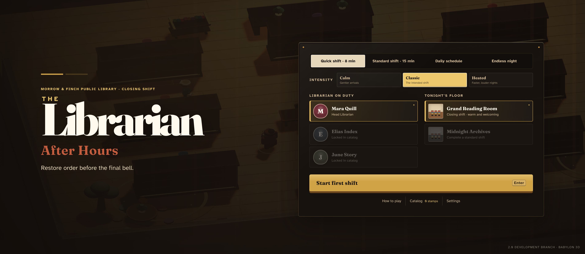
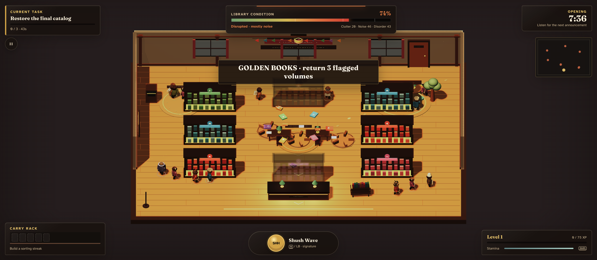
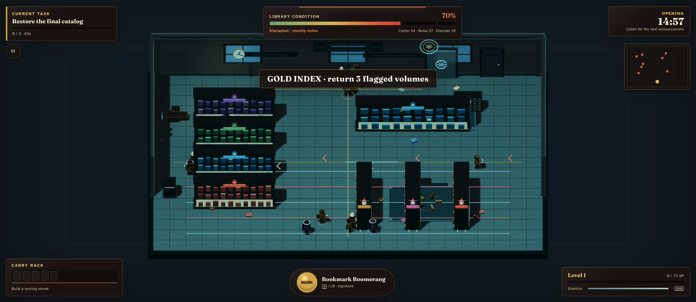

# The Librarian: After Hours

A stylized 3D chaos-control action roguelite about restoring order while a library invents increasingly ridiculous ways to fall apart.



Version 2.0 preserves the original game's automatic book pickup and matching-shelf returns, then builds a much deeper run around routing, crowd control, sorting streaks, authored events, upgrade synergies, and recoverable crisis management. The production entry is a Babylon.js + TypeScript + Vite application. The original 1.0 source remains in the repository as a preserved reference.

| Grand Reading Room finale | Midnight Archives finale |
|---|---|
|  |  |

## Play

| Action | Keyboard | Gamepad |
|---|---|---|
| Move | WASD or arrows | Left stick |
| Sprint | Shift | Right trigger |
| Intervene | Space | South face button |
| Signature tool | Q | Left bumper |
| Pause | Escape or P | Menu |

Walk near loose books to collect them automatically. Match every book's color and symbol to the correct shelf. Use Intervene and your signature tool to interrupt disruptive visitors, clear hazards, and make room for an efficient sorting route.

## What is in 2.0

- Two authored 3D diorama maps: Grand Reading Room and Midnight Archives.
- Three librarians with different starting tools and routing identities.
- Eight kid archetypes with distinct tells, behaviors, and counters.
- Ten tools, twelve passives, and build-changing evolutions.
- Eight section objectives, a dedicated finale objective, six authored events, and two mechanically distinct map-specific crises.
- Standard, Quick, Daily, and Endless schedules with deterministic seeds.
- Chaos sources for Clutter, Noise, and Disorder plus a recoverable Last Call.
- Automatic pickup, visible carry rack, genre symbols, sorting streaks, and upgrade drafts.
- Versioned local saves, catalog unlocks, achievements, personal bests, and same-seed retry.
- Keyboard and gamepad play, focus-loss pause, remapping, independent audio buses, and comfort settings.
- Strict TypeScript, deterministic unit tests, browser journey tests, asset validation, CI, and Vercel preview support.

## Local development

Requires Node.js 22.12 or newer.

```bash
npm ci
npm run dev
```

Open the local URL printed by Vite. Add `?debug=1` to expose the deterministic playtest controls under `window.librarianDebug`.

## Verification

```bash
npm run verify:full
```

The full gate runs linting, typechecking, asset/provenance validation, unit tests, a production build, and Playwright browser journeys. See [Version 2 verification](docs/VERIFICATION.md), the [balance report](docs/BALANCE_REPORT.md), and the [playtest guide](docs/PLAYTEST_GUIDE.md).

## Documentation

- [2.0 product and delivery roadmap](LIBRARIAN_2.0_GAMEPLAN.md)
- [3D art bible](docs/ART_BIBLE.md)
- [Implementation status](docs/IMPLEMENTATION_STATUS.md)
- [Release checklist](docs/RELEASE_CHECKLIST.md)
- [Asset manifest](assets/v2-assets.json)

## Branch safety

The 2.0 work lives on `codex/librarian-2.0`. The GitHub `main` branch remains the 1.0 fallback until the 2.0 preview has passed its external playtest and release gates.
